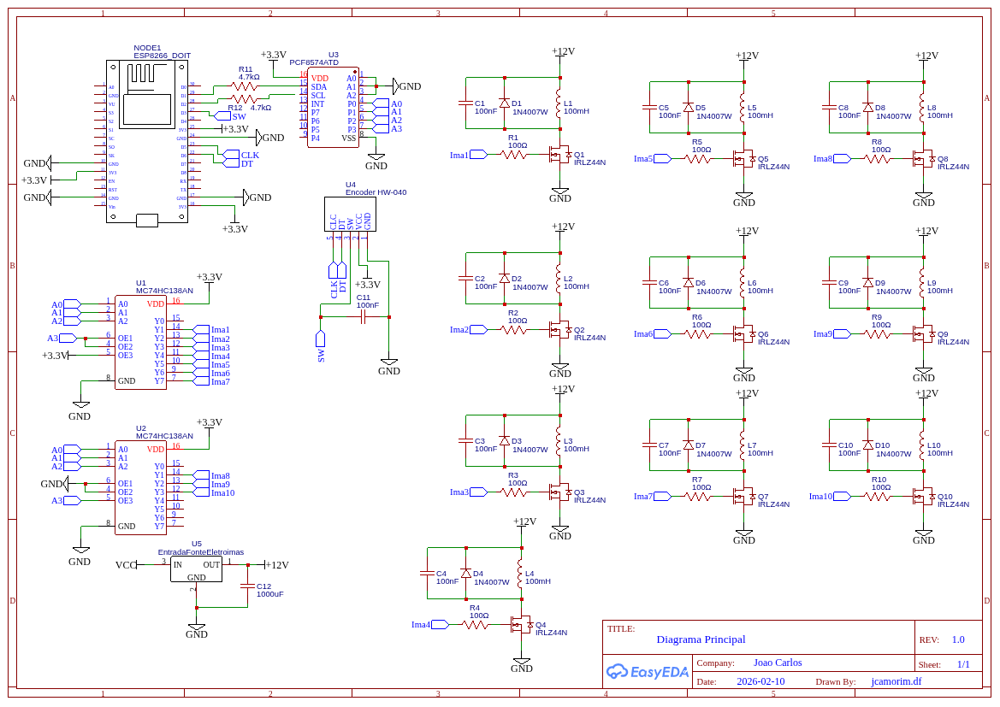

# Sistema de Controle para Jogo de Reflexos 🕹️

Este projeto consiste no desenvolvimento do código-fonte e mapeamento lógico de um sistema embarcado para um jogo de teste de reflexos, onde bastões são liberados aleatoriamente para o jogador capturá-los.

## 🛠️ Tecnologias e Componentes
* **Microcontrolador:** Plataforma Arduino.
* **Atuadores:** Eletroímãs (responsáveis pela retenção e liberação física dos bastões).
* **Eletrônica de Potência:** Transistores MOSFET IRLZ44N (para acionamento seguro das cargas indutivas).
* **Otimização de Hardware:** Módulo Decoder 3 para 8, permitindo o controle de 8 eletroímãs distintos consumindo apenas 3 portas digitais do microcontrolador.

## ⚙️ Funcionalidades Implementadas
* **Geração Aleatória:** Lógica de programação focada na imprevisibilidade da liberação dos componentes físicos.
* **Dificuldade Escalável:** O sistema possui 3 níveis de dificuldade configuráveis, alterando dinamicamente o intervalo de tempo de queda.
* **Eficiência de I/O:** O uso do decoder demonstra a aplicação prática de circuitos lógicos combinacionais para otimizar os recursos de hardware do Arduino.

## 📌 Status do Projeto
O foco desta etapa consistiu na validação da viabilidade técnica da eletrônica. O código foi finalizado e os testes de acionamento de potência com os MOSFETs e eletroímãs foram concluídos com sucesso.

## 🔌 Diagrama Elétrico (Versão Conceitual)
Abaixo está o esquemático do circuito. *Nota: Este mapeamento inicial foi projetado tendo o ESP8266 como controlador base, demonstrando a versatilidade da lógica que posteriormente foi adaptada para o Arduino no código final.*

